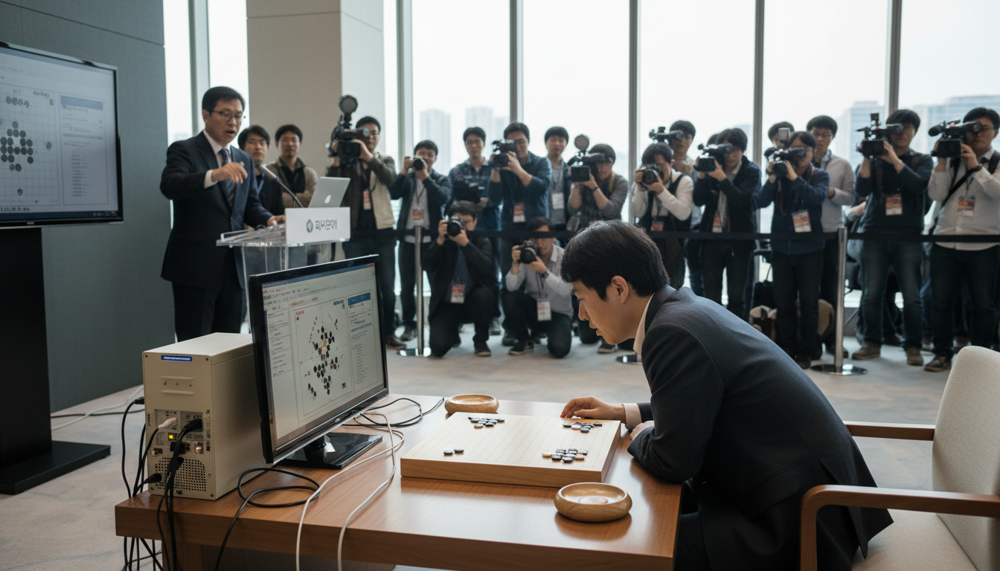

# TIMEPOINT Flash

Generate historically grounded, AI-illustrated scenes from any moment in history. Type a query, get back a complete scene: characters with distinct voices, period-accurate dialog, relationship dynamics, and a photorealistic image — all verified against Google Search.

---

### Example: AlphaGo Plays Move 37

```bash
curl -X POST localhost:8000/api/v1/timepoints/generate/stream \
  -H "Content-Type: application/json" \
  -d '{"query": "AlphaGo plays Move 37 against Lee Sedol in Game 2, Four Seasons Hotel Seoul March 10 2016", "generate_image": true}'
```

**Generated image:**



**Scene:**

```
Location:    Four Seasons Hotel, Seoul, South Korea
Date:        March 10, 2016 — afternoon, spring
Tension:     high

Setting:     A brightly lit, modern conference room arranged for a Go tournament.
             Central Go board on a low, polished wooden table. Lee Sedol sits
             opposite the AlphaGo system, represented by a monitor displaying its
             moves. Journalists, AI researchers, and Go enthusiasts seated in rows
             behind a low barrier. Cables snake across the floor.

Atmosphere:  Intense concentration and quiet anticipation. The audience is hushed.
             A palpable sense of history being made, mixed with disbelief at
             AlphaGo's unconventional moves.
```

**Characters:**

| Name | Role | Voice |
|------|------|-------|
| **Lee Sedol** | primary | Short, halting fragments — stunned understatement |
| **AlphaGo** | primary, silent | Represented by monitor (non-human entity resolved by grounding agent) |
| **Commentator 1** | secondary | Chatty, analytical, comfortable on-air cadence |
| **Commentator 2** | secondary | More measured, technical observations |
| **Tournament Official** | secondary | Formal, procedural |

**Dialog:**

> **Lee Sedol:** "...Huh. That's... certainly a move."
>
> **Commentator 1:** "Well, that's one way to put it. I'm not sure I've ever seen a professional play quite like that before."
>
> **Lee Sedol:** "It's... unexpected, to say the least. Maybe it's a bluff?"
>
> **Commentator 1:** "A bluff? Against AlphaGo? Now that's a thought."
>
> **Commentator 2:** "It's a bold one, if so. I'm not sure even a human could read that."
>
> **Commentator 1:** "It's either genius or madness, and I honestly can't tell which right now."
>
> **Lee Sedol:** "Perhaps both, a little? It's making things... interesting."

**Then interrogate the characters:**

```
> You: "Lee Sedol, what went through your mind when you saw Move 37?"
```

**Or jump forward in time:**

```bash
POST /api/v1/temporal/{id}/next {"units": 1, "unit": "hour"}
# → One hour later: Lee Sedol has left the room. The commentators are still trying to explain it.
```

---

## Quick Start

**Prerequisites:** Python 3.10+ and a Google API key ([free at AI Studio](https://aistudio.google.com))

```bash
git clone https://github.com/timepoint-ai/timepoint-flash.git
cd timepoint-flash
./setup.sh            # Checks prereqs, installs deps, creates .env
# Edit .env → add your GOOGLE_API_KEY
./quickstart.sh       # Starts server + generates a demo scene
```

Or manually:

```bash
pip install -e .
cp .env.example .env  # Add your API key
./run.sh -r           # Start server
./demo.sh             # Interactive demo with 10 templates
```

Swagger docs at `http://localhost:8000/docs`

---

## How It Works

14 specialized agents run a pipeline with parallel execution, Google Search grounding, and a critique-retry loop:

```
Judge → Timeline → Grounding (Google Search) → Scene
                                                  ↓
                          Characters (grounded) + Moment + Camera  [parallel]
                                                  ↓
                                    Dialog → Critique (auto-retry if issues)
                                                  ↓
                                   ImagePrompt → Optimizer → ImageGen
```

**Key capabilities:**

- **Google Search grounding** — Verified locations, dates, participants. Not "a room in New York" but "35th floor of the Equitable Center, Manhattan."
- **Critique loop** — Dialog is reviewed for anachronisms, cultural errors (Greek vs Roman deities), modern idioms, and voice distinctiveness. Auto-retries with corrections if critical issues found.
- **Voice differentiation** — Each character gets a social register (elite/educated/common/servant/child) that constrains sentence structure, vocabulary, and verbal tics. Characters must be identifiable by voice alone.
- **Emotional transfer** — The image prompt optimizer translates narrative tension into physicalized body language instead of discarding it. "Climactic tension" becomes "wide eyes, dropped objects, body recoiling."
- **Entity representation** — Non-human entities (Deep Blue, AlphaGo, HAL 9000) are shown through their physical representatives (IBM operator, monitor display, red camera lens).
- **Anachronism prevention** — Era-specific exclusion lists, mutual exclusion rules (Roman toga + tricorn hat), famous painting drift detection.
- **3-tier image fallback** — Google Imagen → OpenRouter Flux → Pollinations.ai. Image generation never fails.

---

## Example Scenes

**Oppenheimer at Trinity, 5:29 AM July 16 1945:**

```
Location: Control bunker S-10000, Jornada del Muerto desert, New Mexico
Characters: J. Robert Oppenheimer (director), Leslie Groves (general),
            Kenneth Bainbridge (test director), Enrico Fermi (physicist)
Dialog:
  Bainbridge: "Minus ten seconds."
  Fermi: [tearing strips of paper, holding them above his head to measure blast yield]
  Oppenheimer: "..."
  Bainbridge: "Now we are all sons of bitches."
```

**Gavrilo Princip at Schiller's Deli, Sarajevo 1914:**

```
Location: Moritz Schiller's Delicatessen, Latin Bridge, Sarajevo
Date: June 28, 1914 — late morning
Tension: extreme — the car took a wrong turn and stopped right in front of him
Characters: Gavrilo Princip (19-year-old), Archduke Franz Ferdinand,
            Sophie Chotek, Driver Leopold Lojka
```

**Ramanujan arrives at Trinity College, March 1914:**

```
Location: Great Gate, Trinity College, Cambridge
Date: March 1914 — freezing rain, late afternoon
Characters: Srinivasa Ramanujan (26, mathematician), College Porter
Dialog:
  Porter: "Name?"
  Ramanujan: "Ramanujan. I have a letter from Mr. Hardy."
  Porter: "Everyone's got a letter from someone, haven't they."
```

Each scene includes full character bios, relationship graphs, scene metadata, camera composition, and a generated image.

---

## Quality Presets

| Preset | Speed | Provider | Best For |
|--------|-------|----------|----------|
| **hyper** | ~55s | OpenRouter | Fast iteration, prototyping |
| **balanced** | ~90-110s | Google Native | Production quality |
| **hd** | ~2-2.5 min | Google Native | Maximum fidelity (extended thinking) |
| **gemini3** | ~60s | OpenRouter | Latest model, agentic workflows |

```bash
# Hyper for speed
curl -X POST localhost:8000/api/v1/timepoints/generate/stream \
  -d '{"query": "Kasparov Deep Blue Game 6 Equitable Center 1997", "preset": "hyper", "generate_image": true}'

# HD for quality
curl -X POST localhost:8000/api/v1/timepoints/generate/stream \
  -d '{"query": "Oppenheimer Trinity test 5:29 AM July 16 1945", "preset": "hd", "generate_image": true}'
```

---

## API

| Endpoint | Description |
|----------|-------------|
| `POST /api/v1/timepoints/generate/stream` | Generate scene with SSE progress (recommended) |
| `POST /api/v1/timepoints/generate/sync` | Generate scene, block until complete |
| `POST /api/v1/timepoints/generate` | Background generation, poll for result |
| `GET /api/v1/timepoints/{id}` | Retrieve a completed scene |
| `POST /api/v1/interactions/{id}/chat` | Chat with a character |
| `POST /api/v1/temporal/{id}/next` | Jump forward in time |
| `POST /api/v1/temporal/{id}/prior` | Jump backward in time |
| `GET /api/v1/temporal/{id}/sequence` | Get linked timeline |
| `POST /api/v1/eval/compare` | Compare model latencies |
| `GET /api/v1/models/free` | List free OpenRouter models |

Full reference: [docs/API.md](docs/API.md)

---

## Configuration

```bash
# .env
GOOGLE_API_KEY=your-key                              # Required (free at aistudio.google.com)
OPENROUTER_API_KEY=your-key                          # Optional (for hyper/gemini3 presets)
DATABASE_URL=sqlite+aiosqlite:///./timepoint.db      # Default storage
```

---

## Testing

```bash
python3.10 -m pytest tests/unit/ -v         # 447 unit tests
python3.10 -m pytest tests/integration/ -v  # 81 integration tests
python3.10 -m pytest tests/e2e/ -v          # 13 end-to-end tests
```

541 tests covering generation, character interactions, temporal navigation, image fallback, historical grounding, schema validation, and provider failover.

---

## Documentation

- [API Reference](docs/API.md) — Full endpoint documentation
- [Agent Architecture](docs/AGENTS.md) — Pipeline breakdown with example output
- [Temporal Navigation](docs/TEMPORAL.md) — Time travel mechanics
- [Eval Roadmap](docs/EVAL_ROADMAP.md) — Quality scoring and benchmark plans

---

## License

Apache 2.0

---

Built with Python, FastAPI, and Google Gemini. Part of [Timepoint AI](https://x.com/seanmcdonaldxyz).
